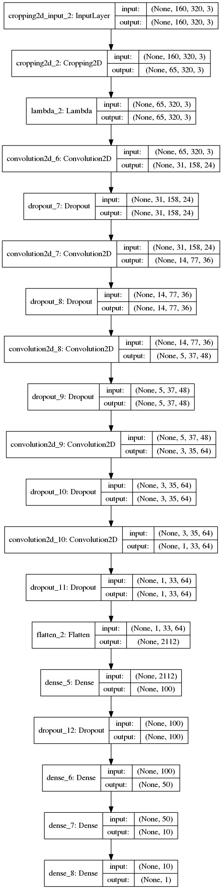

**Behavioral Cloning Project**

The goals / steps of this project are the following:
* Use the simulator to collect data of good driving behavior
* Build, a convolution neural network in Keras that predicts steering angles from images
* Train and validate the model with a training and validation set
* Test that the model successfully drives around track one without leaving the road
* Summarize the results with a written report


## Here I will consider the [rubric points](https://review.udacity.com/#!/rubrics/432/view) individually and describe how I addressed each point in my implementation.  

---
### Required Files

#### Are all required files submitted?

My project includes the following files:
* model.py
* drive.py
* model.h5
* writeup_report.md
* video.mp4

### Quality of Code

#### Is the code functional?
Using the Udacity provided simulator and my drive.py file, the car can be driven autonomously around the track by executing
```sh
python drive.py model.h5
```

#### Is the code usable and readable?

The model.py file contains the code for training and saving the convolution neural network. The file shows the pipeline I used for training and validating the model, and it contains comments to explain how the code works.

### Model Architecture and Training Strategy

#### Has an appropriate model architecture been employed for the task?

According to video lecture, I employed the NVIDIA's architecture[^1].
This can be summarized as follows.
1. Normalize input image
2. Apply 5 convolution layers
3. Apply 3 fully connected layers
4. Output layer

The detail of final architecture is visualized in "Is the model architecture documented?" section.

the 'ReLu' activation is employed in each layer.
Dropout layers are applied after the every convolution layers and the first fully connected layer.

[^1]:http://images.nvidia.com/content/tegra/automotive/images/2016/solutions/pdf/end-to-end-dl-using-px.pdf

#### Has an attempt been made to reduce overfitting of the model?

The model contains dropout layers in order to reduce overfitting (model.py lines 165-183).

The model was trained and validated on different data sets to ensure that the model was not overfitting (code line 135). The model was tested by running it through the simulator and ensuring that the vehicle could stay on the track.


#### Have the model parameters been tuned appropriately?

The model used an adam optimizer, so the learning rate was not tuned manually (model.py line 188).

####Is the training data chosen appropriately?

According to the video lecture advice, I collected different types of driving data such as Driving Counter-Clockwise and Recovery scene.  And I also introduce data augmentation technique such as image flip transformation and exploitation of multiple camera images.

###Architecture and Training Documentation

####Is the solution design documented?

My solution design is described as follows:

1. Collect training data.
2. Select necessary training data.
3. Split selected training to training and validation data.
5. Train a model whose architecture is described in the previous section.
6. Data augmentation is introduced by using generator function.
7. Validation and training loss is checked.
8. Apply trained model to the simulator.
9. If the result is not sufficient, I collected additional training data or train model with different hyperparameters until a good model is obtained.


####Is the model architecture documented?

The final model architecture (model.py lines 156-184) consisted of a convolution neural network based on NVIDIA's architecture.

First, the input image whose size is 160x320x3 is cropped to 65x320x3 and then normalized the value from 0-255 into 0-1.


Figure 1: Image cropping.

After the normalization, five convolution layers are consecutively applied, and then the data shape changed from 160x320x3 to 1x33x64.

Finally, three fully connected layers are applied and I can obtain steering angle prediction. Since steering angles are real numbers, this is a regression model.

In convolution and fully connected layers, 'ReLu' activations are used.
And dropout layers are introduced in order to reduce the overfitting. The ratio of dropout is set as `0.2` (`0.8` of nodes are alive)
Typical training and validation curve are shown in the Figure


Figure 2: Training and validation loss curve.

Here is a visualization of the architecture. This is generated by using keras function.


Figure 3: Model architecture used in this project.

####Is the creation of the training dataset and training process documented?

All training data are recorded in track one. The recorded data are stored in separate directories so that I can apply different data preprocessing depending on the data acquisition method. I recorded clockwise course drives and counter-clockwise course drives. Each of them is recorded two laps. And then I also recorded the vehicle recovering from the left side and right sides of the road back to center so that the vehicle would learn to avoid across the edges of the road.

In order to make the recovering situation, I deliberately changed the direction toward an edge of the road from the center. But such a training data (go to edge from center) may disturb the model, so I selected only recovering scene from raw training data. For example, when I collect the scene where the vehicle recovers from right side to center, I used the training data whose steering angles are negative (model.py lines 71-72).

Most recorded data are driving straight where steering angle is `0`, this may introduce model bias which prevents the vehicle from curve the corner. To reduce the bias, I downsample the training data with zero steering angle (model.py lines 84).
In the final model, I dropped `1/3` of straight data.


Figure 4: Top is original steering angle distribution of training data. The bottom is a distribution with downsampled straight driving data. The peaks around -0.25 and 0.25 are introduced by data augmentation of left and right camera image.

To augment the data, I randomly flipped images and angles. This process is added in the generator function (model.py lines 144-116). I also used left and right side image with the correction angle $\pm0.25$ (model.py lines 89, 90).


Figure 5: Different camera views are shown. These are taken from different camera positions. Steering angle corrections are introduced such as (+0.25, 0.0, -0.25) from left to right.

After some trial and errors, I observed that the vehicle has some difficulty for the specific corner or situations. To overcome the difficulty, I introduce some additional training data including only the positions in which the model fails. For example, when a model failed to curve the specific corner, I added records the vehicle drives around the corner.
